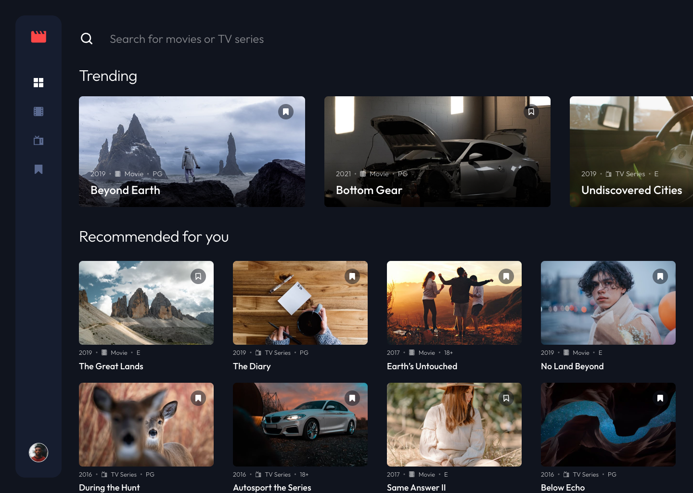
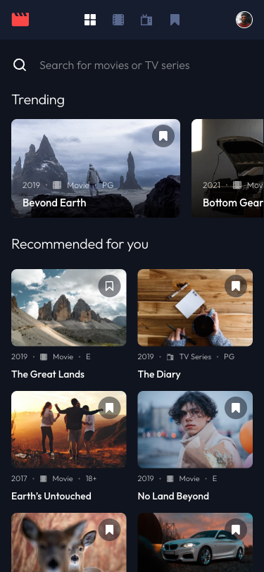

# Frontend Mentor - Entertainment web app solution

A React single-page app to browse, search and bookmark movies and TV series, built pixel-close to the [Entertainment web app challenge on Frontend Mentor](https://www.frontendmentor.io/challenges/entertainment-web-app-J-UhgAW1X), including the bonus full-stack sign-up/login flow.

    

## Table of contents

- [Overview](#overview)
  - [The challenge](#the-challenge)
  - [Screenshot](#screenshot)
  - [Links](#links)
- [Getting started](#getting-started)
- [Project structure](#project-structure)
- [Tests](#tests)
- [My process](#my-process)
  - [Built with](#built-with)
  - [What I learned](#what-i-learned)
  - [Continued development](#continued-development)
  - [Useful resources](#useful-resources)
  - [AI Collaboration](#ai-collaboration)
- [Contributing](#contributing)
- [License](#license)
- [Author](#author)
- [Acknowledgments](#acknowledgments)

## Overview

### The challenge

Users should be able to:

- View the optimal layout for the app depending on their device's screen size
- See hover states for all interactive elements on the page
- Navigate between Home, Movies, TV Series, and Bookmarked Shows pages
- Add/Remove bookmarks from all movies and TV series
- Search for relevant shows on all pages
- **Bonus**: Build this project as a full-stack application — the API lives in [fsdev-entertainment-web-app-backend](https://github.com/gusanchefullstack/fsdev-entertainment-web-app-backend)
- **Bonus**: Sign up, log in and keep bookmarks per account

Search is scoped per page (all shows, movies, TV series or your bookmarks), a bookmark clicked while signed out is saved automatically after you log in, and the navigation turns into a fixed sidebar on screens 1024px and wider.

### Screenshot

<p>
  
</p>
<p>
  
</p>

### Links

- Solution URL: [Frontend Mentor solution](https://www.frontendmentor.io/solutions/entertainment-web-app-caUFWUJMRV)
- Live Site URL: [frontend-kappa-three-73.vercel.app](https://frontend-kappa-three-73.vercel.app/)

> The API runs on Render's free tier, which sleeps when idle. The first request after a quiet
> period can take 30-60 seconds to wake; after that the app responds normally.

## Getting started

**Prerequisites:** Node.js >= 26, npm >= 12, and the [backend API](https://github.com/gusanchefullstack/fsdev-entertainment-web-app-backend) running on `http://localhost:3000`.

```bash
git clone git@github.com:gusanchefullstack/fsdev-entertainment-web-app-frontend.git
cd fsdev-entertainment-web-app-frontend
npm install
npm run dev          # http://localhost:5173
```

Vite proxies `/api` to the backend, so the session cookie stays first-party. In production a `vercel.json` rewrite (added at deployment) forwards `/api/*` to the deployed API the same way.

| Script | What it does |
|---|---|
| `npm run dev` | Start the Vite dev server with the `/api` proxy |
| `npm run build` | Type-check and build to `dist/` |
| `npm run preview` | Serve the production build locally |
| `npm run typecheck` | Run `tsc --noEmit` |
| `npm test` | Run the Vitest suite once |

## Project structure

```text
src/
├── api/          # ApiClient (fetch wrapper, ApiError) and shared types
├── assets/       # SVG icons, logo and avatar from the design
├── components/   # One folder per component: Name.tsx + Name.module.css
├── context/      # Catalog, Auth, Bookmarks and Toast providers
├── lib/          # Search, safe redirects, pending bookmark, friendly messages
├── pages/        # Home, Movies, TV Series, Bookmarks, Login, Sign Up, Not found
└── styles/       # tokens.css (all design values) and global.css
public/thumbnails # Show images served as static files
tests/            # Vitest + Testing Library suites and helpers
```

## Tests

Tests use [Vitest](https://vitest.dev/), [Testing Library](https://testing-library.com/) and [axe-core](https://github.com/dequelabs/axe-core) in jsdom.

```bash
npm test
```

The suite covers every acceptance scenario of the four user stories (browse, accounts, bookmarks, search), including keyboard behaviour, per-page search scopes, optimistic bookmark rollbacks and an automated accessibility check on each page.

## My process

### Built with

- Semantic HTML5 landmarks, one `main` and one `h1` per page
- CSS Modules with CSS custom properties from a single `tokens.css`
- CSS Grid, Flexbox and scroll snapping
- Mobile-first workflow (breakpoints at 768px and 1024px)
- [React 19](https://react.dev/) with context providers
- [React Router 8](https://reactrouter.com/) for page addresses and redirects
- [Vite 8](https://vite.dev/) and [TypeScript 7](https://www.typescriptlang.org/)
- [Fontsource Outfit](https://fontsource.org/fonts/outfit) self-hosted font

### What I learned

- **Design tokens straight from Figma.** Reading variables bound to each frame (not the whole design-system page) avoided importing unused library colors; every size and colour now lives in `src/styles/tokens.css`.
- **Recoloring SVG icons on hover** with `mask` and `background-color`, so one SVG file serves the default, hover and active states:

```css
.icon {
  background-color: var(--color-blue-500);
  mask: var(--icon) center / contain no-repeat;
}
.link:hover .icon { background-color: var(--color-red-500); }
.link[aria-current='page'] .icon { background-color: var(--color-white); }
```

- **Optimistic UI with a safe rollback.** The bookmark button flips instantly; if the request fails it reverts and a friendly toast explains why, and a 401 sends you to Login with a `returnTo` that only accepts known internal paths.
- **Same-origin API through a proxy.** Calling the API through the frontend's own domain keeps the `HttpOnly` session cookie first-party, which Safari requires.
- **Accessible names over visual text.** Icon-only links and bookmark buttons carry unique visually hidden names such as "Remove Beyond Earth from bookmarks", and Lighthouse caught a skipped heading level that tests had missed.

### Continued development

- The red call-to-action button from the design has a 3.3:1 contrast ratio with white text; I want to find a variant that keeps the look and meets WCAG AA.
- End-to-end browser tests for the full sign-up → bookmark → sign-out flow.

### Useful resources

- [MDN: CSS mask](https://developer.mozilla.org/en-US/docs/Web/CSS/mask) - The trick behind the recolourable nav and bookmark icons.
- [Testing Library: queries by role](https://testing-library.com/docs/queries/byrole/) - Writing tests the way screen-reader users navigate.
- [WAI-ARIA disclosure pattern](https://www.w3.org/WAI/ARIA/apg/patterns/disclosure/) - Used for the avatar account menu.

### AI Collaboration

- **Tool:** Claude Code with Spec Kit (spec → clarify → plan → tasks → implement) plus the Figma and Chrome DevTools MCP servers.
- **How:** Turning the brief into a spec, resolving open questions (bookmark ownership, data source), writing tests first, reading exact values from Figma frames and comparing screenshots at 375, 768 and 1440px.
- **What worked:** Pixel checks against Figma and Lighthouse audits caught layout offsets and a heading-order issue early.
- **What didn't:** Some Figma variables were empty (the card gradient) and had to be read from individual nodes instead.

## Contributing

1. Fork the repo and create a branch such as `feat/short-description`.
2. Use [Conventional Commits](https://www.conventionalcommits.org/) (`feat:`, `fix:`, `docs:`).
3. Run `npm run typecheck && npm test` before opening a pull request.

## License

Distributed under the MIT License. See [LICENSE](./LICENSE) for details.

## Author

**Gustavo Sanchez Galarza**

[](https://www.linkedin.com/in/gustavosanchezgalarza/) [](https://github.com/gusanchefullstack) [](https://hashnode.com/@gusanchedev) [](https://x.com/gusanchedev) [](https://bsky.app/profile/gusanchedev.bsky.social) [](https://www.freecodecamp.org/gusanchedev) [](https://www.frontendmentor.io/profile/gusanchefullstack)

## Acknowledgments

- [Frontend Mentor](https://www.frontendmentor.io/) for the challenge, design and assets.
